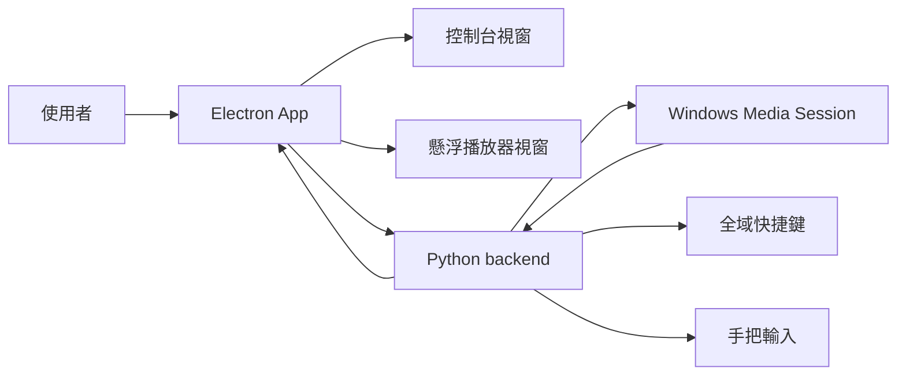

# Electron + Python Migration Plan

本文件規劃 Gaming Music Overlay從 Tkinter UI 遷移到 Electron + Vue 3 + Vite + TypeScript，同時保留 Python 作為 Windows 媒體控制後端。

## 目標

- 使用者最終只需要執行安裝檔或 exe，不需要懂 Python、Node.js 或手動裝依賴。
- 保留目前已驗證可在 Forza 顯示的核心能力：Windows Media Session、懸浮播放器、快捷鍵、手把控制。
- UI 改由 Electron/Vue 實作，讓控制台、初次使用引導、Spotify/YouTube Music 主題更容易設計與維護。
- 先建立可開發、可測試的雙程序架構，再做正式打包。

## 技術選型

- Electron：桌面 app shell、視窗、托盤、生命周期、未來安裝包。
- Vue 3 + Vite + TypeScript：控制台與懸浮播放器 UI。
- Python：Windows Media Session、媒體鍵、快捷鍵、手把輸入。
- IPC：第一階段使用 stdin/stdout JSON lines，避免開 localhost server 造成防火牆提示。

## 目錄安排

```text
gaming-music-overlay-python/
  forza_music_overlay.py             # 現有 Python app；新增 --stdio-backend 給 Electron 呼叫
  requirements.txt                   # Python 依賴
  Build-Release.ps1                  # 既有 Tkinter 發布腳本，先保留
  docs/
    ELECTRON_PYTHON_PLAN.md          # 本文件
  electron-app/
    package.json
    electron.vite.config.ts
    src/
      main/
        index.ts                     # Electron main process，啟動 Python backend
      preload/
        index.ts                     # 安全暴露 IPC API 給 Vue
      renderer/
        index.html
        src/
          App.vue                    # 依 view=control/overlay 切換 UI
          main.ts
          style.css
          types.ts
```

## 程序架構



## JSON Protocol

Python -> Electron:

```json
{"type":"backend:ready","version":"1.1.0"}
{"type":"track:update","track":{"title":"...","artist":"...","status":"PLAYING"}}
{"type":"gamepad:status","message":"手把控制已啟用"}
{"type":"hotkey:error","message":"..."}
{"type":"command","command":"toggle_overlay"}
```

Electron -> Python:

```json
{"type":"media:playPause"}
{"type":"media:next"}
{"type":"media:previous"}
{"type":"media:volumeUp"}
{"type":"media:volumeDown"}
{"type":"media:mute"}
{"type":"open:youtube"}
{"type":"open:spotify"}
{"type":"app:quit"}
```

## 打包策略

第一階段只做開發骨架，不打包。

正式打包時：

1. PyInstaller 將 Python backend 打成 `GamingMusicBackend.exe`。
2. electron-builder 把 backend exe 放進 Electron resources。
3. Electron 安裝包建立桌面捷徑、開始功能表捷徑、解除安裝入口。
4. 最終產出使用者只看到安裝檔或 portable exe，不需要手動安裝 Python/Node/依賴。

## UI Design Direction

根據 UI/UX Pro Max 產生的方向，本 app 以深色、緊湊、遊戲內可讀為優先：

- YouTube Music 使用紅色 accent，Spotify 使用綠色 accent。
- 控制台採清楚分區：音樂來源、目前播放、懸浮播放器、控制方式。
- 懸浮播放器保持低高度、左上角可讀，避免遮住賽車畫面。
- 不用 emoji 當圖示，互動元件使用一致 icon set。
- hover/focus 狀態要清楚，但不要造成 layout shift。

## 遷移順序

1. 新增 Python `--stdio-backend`。
2. 建立 Electron/Vue 開發骨架。
3. 控制台先接收即時歌曲資訊。
4. 懸浮播放器視窗接收同一份歌曲資訊。
5. 將快捷鍵命令導到 Electron 視窗狀態。
6. 加入 tray，避免隱藏控制台後找不到程式。
7. 建立 Electron 打包流程與版本號策略。

